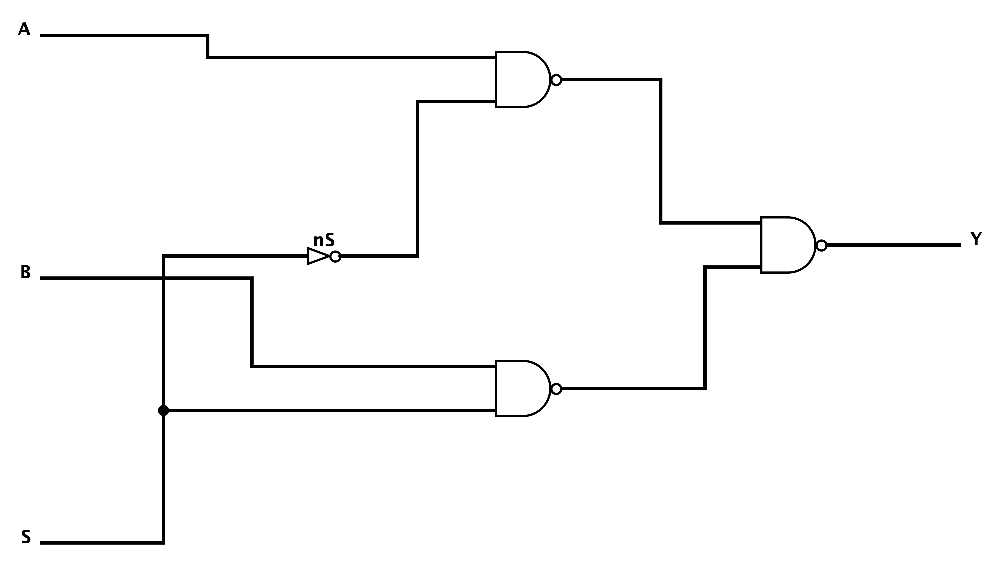
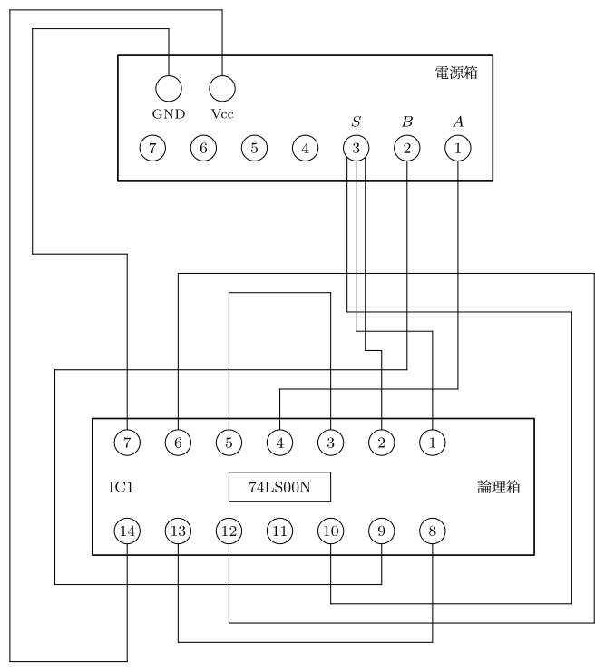

# logikit

論理回路の図を Python から **生成・検証・描画** するツールキットです。ゲート回路図
（実配線の Logisim `.circ` → PNG）と、ブレッドボード／DIP の結線図（→ ベクタ PDF）を、
手描きせずに、しかも**配線が正しいことを機械的に確かめながら**作れます。

論理回路実験のレポートを書くときに、NAND だけで組んだ回路図や 74 シリーズの結線図を
たくさん、**正確に**・見た目を揃えて用意する必要があり、その作業を再現可能にするために
作ったものです。

<p align="center">
  <br>
  <em>1 個の NOT と 3 個の NAND で作った 2:1 マルチプレクサ。logikit で生成 → 接続検証
  → 描画したもの（<code>examples/</code> 参照）。</em>
</p>

## なぜ作ったか

多くの `.circ` ジェネレータはゲート同士を *トンネル*（名前で結ぶ仮想配線）でつなぎます。
これだとシミュレーションは通っても、描画した絵は回路図には見えません。logikit は
**実際の直交配線**を引くので、描画結果は接続点のドットや交差まで含めた本物のゲート＋配線図に
なります。さらに、図を信用する前に、配線が意図どおりかを静的チェッカが検証します。

## できること

| 機能 | モジュール／ファイル | 出力 |
|---|---|---|
| 小さな Python DSL から回路図を生成（実配線） | `logikit/circ.py` | `name.circ`, `name_fig.circ`, `name.spec` |
| 接続を**静的に検証**（ショート・断線を検出） | `logikit/check.py` | OK／FAIL レポート |
| ネットリストをシミュレート（真理値表・**発振検出**） | `logikit/sim.py` | 真理値表 |
| Logisim 自身の描画コードで `.circ` を PNG 化 | `render/LogiRender.java` + `render/render.sh` | `name.png` |
| ブレッドボード／DIP の結線図 | `logikit/wiring.py` | `name.pdf` |

Python パッケージは**標準ライブラリのみ**で、生成・検証・シミュレーションに依存パッケージの
`pip install` は不要です。描画には JDK ＋ Logisim の jar（PNG）や `lualatex`（結線図 PDF）が
必要です。

## 必要なもの

- **Python ≥ 3.9**（生成・検証・シミュレーション。標準ライブラリのみ）
- PNG 描画用に **JDK** と **[Logisim-evolution](https://github.com/logisim-evolution/logisim-evolution)**
  の `…-all.jar`。`LOGISIM_JAR` で場所を指定します（jar は約 50 MB かつ第三者配布物なので
  **同梱していません**）。macOS では `/Applications/Logisim-evolution.app/...` を自動検出します。
- 結線図 PDF 用に **`lualatex`** ＋ CJK フォント（例: TeX Live 同梱の Harano Aji）。箱のラベルは
  既定で日本語（論理箱／電源箱）です。英字のみにしたい場合は `scene.logic_label` /
  `scene.power_label` を ASCII に設定してください。

## クイックスタート

```bash
git clone https://github.com/taitaitai58/logikit
cd logikit

# 1. 例の回路図を生成し、接続チェック＋シミュレーションを実行
python3 -m examples.circuits
#   -> build/{mux2_nand,and3_nand,ring_osc_nand}{,_fig}.circ + .spec
#   -> 接続レポート（すべて OK）＋ 真理値表（リング発振器は UNSTABLE）

# 2. 綺麗な PNG を描画（Logisim 自身の描画コードを使用）
export LOGISIM_JAR=/path/to/logisim-evolution-X.Y.Z-all.jar
./render/render.sh build/mux2_nand_fig.circ build/mux2_nand.png 4

# 3. ブレッドボード結線図を生成（lualatex ＋ CJK フォントが必要）
python3 -m examples.breadboard
#   -> build/wiring_mux2.pdf
```

## 動かないときは（トラブルシューティング）

依存（JDK・Logisim の jar・lualatex・CJK フォント）が多いので、まず**環境診断**を
実行してください。何が使えて、足りないものはどう入れるかを表示します。

```bash
python3 -m logikit.doctor      # または make doctor
```

各エラーは原因と対処をメッセージで出します。代表例:

| 症状 | 原因と対処 |
|---|---|
| `render.sh` が `java`/`javac not found` | JDK を入れる（`brew install temurin` / `apt install default-jdk`）。JRE だけでは `javac` が無いので不可。 |
| `render.sh` が `Logisim jar not found` | `export LOGISIM_JAR=/path/to/logisim-evolution-X.Y.Z-all.jar`。jar は[こちら](https://github.com/logisim-evolution/logisim-evolution/releases)から。macOS は app を入れれば自動検出。 |
| `lualatex was not found` | TeX を入れる（`brew install --cask mactex-no-gui` / `apt install texlive-luatex texlive-lang-japanese`）。`.circ` 生成・検証・シミュレーションには不要。 |
| 結線図が**フォント**エラーで失敗 | CJK フォント（Harano Aji 等）が無い。`texlive-lang-japanese` を入れるか、`DOC_LATIN` ＋ ASCII ラベルで CJK 不要にする（下記）。 |
| `FileNotFoundError: '...circ' not found` | 先に `emit('name', builder, 'build')` で生成してから `check`/`truth_table` を呼ぶ。 |

CJK フォントを使わず英字だけで結線図を作るには:

```python
from logikit.wiring import Scene, render_scene, DOC_LATIN
s = Scene(1); s.logic_label, s.power_label = "Logic box", "Power box"
# ... s.net(...) ...
render_scene(s, "demo", "build", doc=DOC_LATIN)   # CJK フォント不要
```

## 結線図（ブレッドボード／DIP）

「どの IC ピンとどのピンをつなぐか」を、14 ピン DIP（例: 74LS00 クアッド NAND）の論理箱と
電源箱の上に直交ケーブルで描きます。下図は上の 2:1 マルチプレクサを 1 個の 74LS00 上に
実装したものです（入力 A・B・S は電源箱の電鍵へ、出力は論理箱のピン LED で読むため
電源箱へは配線しません）。

<p align="center">
  <br>
  <em>同じ 2:1 マルチプレクサの結線図。<code>examples/breadboard.py</code> で生成。</em>
</p>

```python
import sys; sys.path.insert(0, '.')
from logikit.wiring import Scene, render_scene

def wiring():
    s = Scene(1)                       # 論理箱（14 ピン DIP）1 個
    s.ic_tags = {0: "IC1"}
    s.elec_labels = {1: "$A$", 2: "$B$"}   # 電源箱の電鍵ラベル
    s.net([('E', 1), ('P', 0, 1)])     # 電鍵 1 -> 箱0 ピン1
    s.net([('P', 0, 3), ('P', 0, 4)])  # 箱0 ピン3 -> ピン4
    s.gnd_net(); s.vcc_net()           # ピン7=GND, ピン14=Vcc を電源箱へ
    return s

render_scene(wiring(), 'wiring_demo', 'build')   # -> build/wiring_demo.pdf
```

- 端子の指定: `('E', n)` = 電鍵 `n`（1〜7）／`('P', k, pin)` = 論理箱 `k` のピン `1〜14`。
  74LS00 のゲート対応は 出力ピン `3←(1,2)`, `6←(4,5)`, `8←(9,10)`, `11←(12,13)`、`Vcc=14`,
  `GND=7`。
- **配線は 2 端子ケーブルのみ（枝分かれなし）**。実際のジャンパ線は端点が 2 つなので、
  再現性のため 1 本のケーブルは途中で分岐しません（はんだ点・T 字接続なし）。3 端子以上の
  ネットは、その**ソース端子（極）から各端子へ独立した 2 端子ケーブルを星状に延ばして**
  配線します。`net([...])` の **先頭端子がソース（極）**で、入力なら電鍵、内部信号なら
  駆動ゲートの出力ピンを先頭に置きます（極は電鍵／ブレッドボード列なので複数のケーブル端を
  挿せます）。`gnd_net()` / `vcc_net()` も GND / Vcc 端子から各 IC へ星状に配線します。
- ここでの慣習: **出力は論理箱の内蔵ピン LED で読むため、電源箱へは戻し配線しない**
  （電源箱から来るのは入力のみ）。
- 詳しくは `examples/breadboard.py` を参照。

## 自分の回路を書く

回路は「ゲートを置いて配線する関数 `fn(c)`」を書くだけです。生成後に Logisim で開く、
または `_fig` 版を PNG 化します。

```python
from logikit.circ import emit
from logikit.check import check
from logikit.sim import truth_table

def half_nand(c):
    A  = c.pin_in(90, 100, 'A')
    B  = c.pin_in(90, 260, 'B')
    g  = c.nand(360, 180)              # NAND ゲート、出力は (360,180)
    Yo = c.pin_out(520, 180, 'Y')      # Y = NOT(A AND B)
    c.fan(A, 200, [g['in'][0]], net='A')
    c.fan(B, 180, [g['in'][1]], net='B')
    c.path(g['out'], Yo)
    c.mark('Y', g['out'])

emit('half_nand', half_nand, 'build')  # build/half_nand{,_fig}.circ + .spec を書き出す
check('half_nand', 'build')            # 接続の静的チェック
truth_table('half_nand', 'build')      # 2×2 の真理値表
```

真理値表は**レポートに貼れる形式**でも出せます。`truth_table_str(name, dir, fmt)`
（`fmt='md'` / `'latex'`）が表を文字列で返すほか、CLI からも:

```bash
python3 -m logikit.sim --dir=build --format=md    half_nand   # Markdown 表
python3 -m logikit.sim --dir=build --format=latex half_nand   # LaTeX tabular
```

発振して安定しない行（リング発振器など）は出力欄が `—`（LaTeX は `\textemdash`）に
なり、表の下に注記が付きます。

### DSL

`Circ`（`logikit/circ.py`）の主なメソッド:

- `c.pin_in(x, y, label)` / `c.pin_out(x, y, label)` — 入出力端子。
- `c.gate(x, y, kind, n=2)` — 2〜3 入力ゲート。`kind` は `NAND`/`AND`/`OR`/`NOR`/`XOR`/`XNOR`。
  `nand(...)`・`notg(...)` は短縮形。
- `c.nand_inv(x, y)` — 入力を結んだ NAND によるインバータ（クアッド NAND の定番技）。
   net をマークするときは tie ノードではなく返り値の `pins` を使う。
- `c.w(p, q)` / `c.path(*pts)` — 直交配線。
- `c.fan(driver, trunk_x, [receivers], net=...)` — 1 つの出力を縦トランクで複数の受け手へ分配。
- `c.mark(net, *ports)` — 各ポートの**意図する** net を宣言（`logikit.check` が実際の形状と照合）。

**ジオメトリ**（Logisim `size=50`、グリッド 10、ゲートは東向き）: ゲート出力は `(x, y)`、
2 入力は `(x-DX, y-20)` と `(x-DX, y+20)`（3 入力目は中央 `(x-DX, y)`）。`DX` は本体幅 50 ＋
入出力辺の装飾分で、ゲート種別ごとに異なります（Logisim の実ポートを実測して確認）:
`AND`/`OR` は `DX=50`、`NAND`/`NOR` は出力バブル +10 で `DX=60`、`XOR` は入力アーク +10 で
`DX=60`、`XNOR` は両方で `DX=70`。`NOT` は幅 30 なので入力は `(x-30, y)`。`c.gate(...)` が
種別ごとに正しい入力座標を返すので、通常は `g['in'][i]` をそのまま使えば気にする必要はありません。
接続は Logisim と同じく**幾何的に**決まります — 端点を共有する／
T 字で接する配線は同一 net、ただの交差は**非接続**。したがって、各 net は連結した直交線分の木に
保ち、ある net の**端点**を別の net の配線上に乗せない（乗せるとショート）こと。交差自体は
問題ありません（ドットなし・非接続）。

## AI から使う

このリポジトリには [Claude Code](https://claude.com/claude-code) 用の **skill** を同梱しています
（[`.claude/skills/logisim-figures/SKILL.md`](.claude/skills/logisim-figures/SKILL.md)）。
リポジトリを Claude Code で開けば、生成 → 検証 → 描画のループを AI に任せられます
（例:「NAND の SR ラッチを描いて検証して」）。

## ディレクトリ構成

```
logikit/
├── logikit/            # 標準ライブラリのみのパッケージ: circ, check, sim, wiring
├── render/             # LogiRender.java + render.sh（ヘッドレス .circ -> PNG）
├── examples/           # mux2 / and3 / リング発振器 ＋ 74LS00 結線図
├── .claude/skills/     # logisim-figures の AI skill
└── docs/               # この README 用のレンダリング画像
```

## スコープについて

このツールキットは*エンジン*のみです。ここに含まれる例（MUX、3 入力 AND、リング発振器）は
機能を示すための汎用部品で、**特定の課題回路やレポートの内容は一切含みません**。

## License

[MIT](LICENSE)

---

<sub>**English:** logikit generates, **verifies** and renders digital-logic figures
from Python — real-wire Logisim `.circ` schematics (→ PNG) and 74-series breadboard
wiring diagrams (→ PDF). Pure-stdlib core; see the Quickstart and `examples/` above.</sub>
